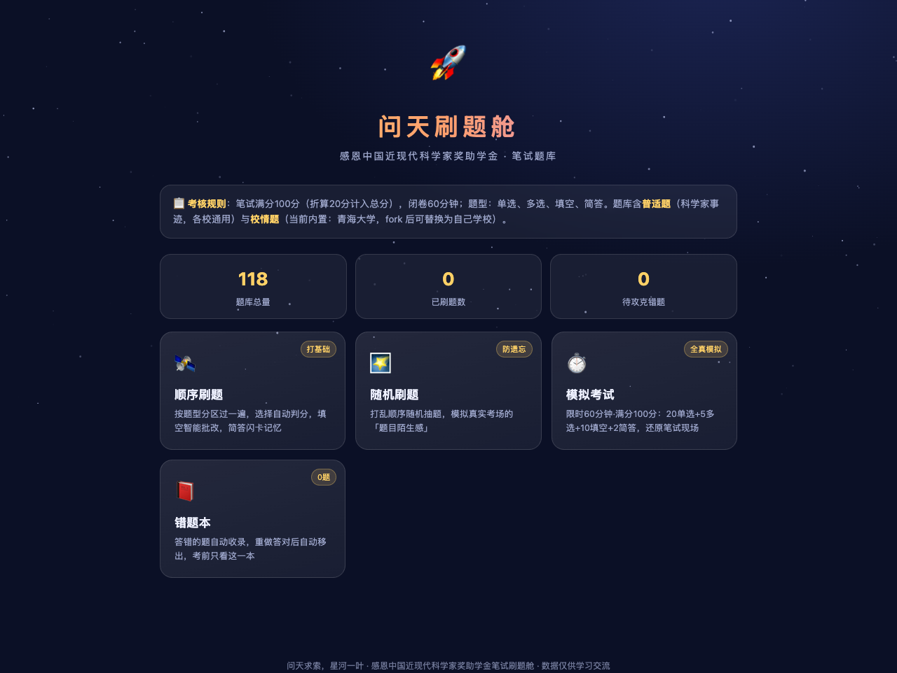
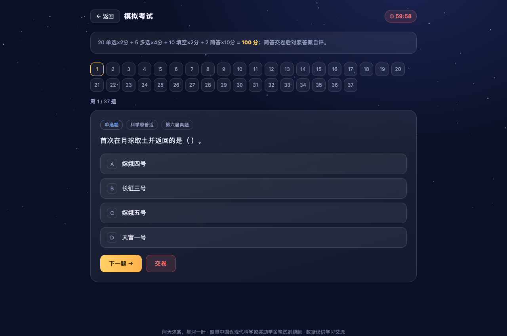

# 问天刷题舱 🚀

**感恩中国近现代科学家奖助学金 · 笔试刷题小站**

> 🔗 **在线体验**：https://jiazhaojune-gif.github.io/ganen-scientist-quiz/
> （浏览器打开即用，不用注册、不用下载）

一个纯前端单页应用（零依赖、无需后端），把散落的笔试真题 / 回忆卷 / 知识点整理成一个可以随手刷、能模拟考试、自动记错题的星空主题刷题舱。

> 仓库只收录**各校通用的普适题**（科学家事迹、两弹一星元勋、国家最高科学技术奖、共和国勋章、航天里程碑）。
> **校情题刻意不收录** —— 每校不同，放进来只会互相污染。改成「自己加一个文件」的方式，见下方 [接入自己学校的校情题](#-接入自己学校的校情题)。




## ✨ 功能

| 模式 | 说明 |
|---|---|
| 🛰️ 顺序刷题 | 按题型分区过题库，单选/多选自动判分，填空关键词智能批改，简答做成翻转闪卡 |
| 🌠 随机刷题 | 打乱顺序抽题，模拟考场「题目陌生感」 |
| ⏱️ 模拟考试 | 限时 60 分钟 · 满分 100：20 单选×2 + 5 多选×4 + 10 填空×2 + 2 简答×10，交卷自动出分并折算总评分（×20%） |
| 📕 错题本 | 答错自动收录，重做答对自动移出（localStorage 本地保存进度，不上传任何数据） |

支持按「题型 × 分区」筛选，进度与错题全部存在浏览器本地。

## 📋 考核规则（据各高校官方通知整理）

- 评审总分 100 = 基础分 40（综测排名）+ **笔试 20** + 面试 40
- 笔试闭卷 60 分钟，卷面 100 分，题型为单选 / 多选 / 填空 / 简答（各校自定）
- 范围 = **普适题**（中国近现代科学家事迹与成果、两弹一星 23 位元勋等，立德树人中心提供部分必考题）+ **校情题**（本校校史校情、著名科学家校友事迹）
- 参考来源：立德树人中心网站科学家主页、其公众号推文及《爱讲科学家故事的小π》系列短视频

## 📚 题库说明

`questions.js` 内置 **140 题，全部为普适题**，每题标注来源：

| 题型 | 数量 | 主要来源 |
|---|---|---|
| 单选 single | 33 | 第六届真题、其他高校真题 |
| 多选 multiple | 10 | 第六届真题、博雅书院真题 |
| 填空 fill | 73 | 2022 / 2023 笔试回忆卷、元勋事迹、航天与科技里程碑 |
| 简答闪卡 flash | 24 | 23 位两弹一星元勋深度问答、高频简答 |

补充整理进题库的公开资料：国家最高科学技术奖历届得主、共和国勋章科学家、载人航天工程三十年里程碑（神舟一号 → 空间站建成）。

## 🍴 接入自己学校的校情题（Fork 指南）

题库与代码分离，校情题放在独立文件里，**不用改 `questions.js`**，以后也能干净地合并上游的普适题更新。

1. Fork 本仓库
2. 把 `school.example.js` 复制一份，重命名为 **`my-school.js`**（和 `index.html` 同目录）
3. 把里面的题目换成你们学校的：校训、建校年份、校史大事、著名科学家校友、现任校长院士、服务国家战略的代表性成果
4. 刷新页面 —— 页面自动加载 `my-school.js`，首页题库总量增加，「🏫 XX校情」筛选按钮自动出现

```js
// my-school.js
window.MY_SCHOOL_META = { name: "我的大学" };

window.MY_SCHOOL_BANK = [
  { id: "x01", type: "fill", section: "school", source: "校史馆",
    question: "我校的校训是「______」。",
    answer: "（你的校训）", keywords: ["关键词"], note: "一字不差背下来" },
];
```

字段说明（和 `questions.js` 完全一致）：

- `type`：`single` 单选（`answer` 为正确选项下标）| `multiple` 多选（`answer` 为下标数组）| `fill` 填空（`keywords` 全部命中判对）| `flash` 简答闪卡（自评掌握）
- `section`：固定填 `"school"`
- `source`：题源标注，方便回查

> 校情题信息量大、各校差异大，是最值得自己动手整理的一部分。欢迎整理好后提 PR 把模板做得更好，但**主仓库不放任何具体学校的题目**。

## 🚀 本地使用 / 部署

纯静态文件，直接双击 `index.html` 用浏览器打开即可（不需要装任何东西）。

开启 GitHub Pages：仓库 **Settings → Pages → Source 选 `main` 分支根目录**，几分钟后访问
`https://<你的用户名>.github.io/ganen-scientist-quiz/`

## 🤝 一起完善

- 发现题目有误、想补充普适题 → 提 Issue 或 PR，注明来源
- 想做自己学校的校情题库但没时间整理 → 可以在 Issue 里留学校名，按「共创共建」的方式一起整理

## ⚠️ 声明

题目整理自历年考生回忆与公开资料，仅供学习交流；答案以官方口径为准。侵删。项目与奖学金主办方无隶属关系。

---

问天求索，星河一叶。祝每一位申请者都能如愿 🌟
